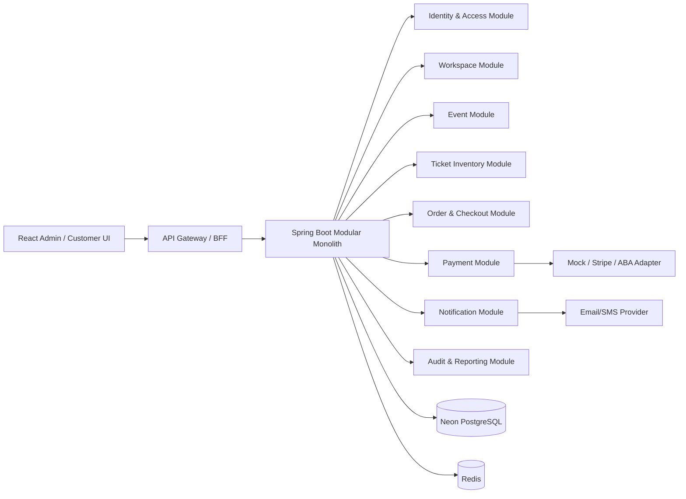
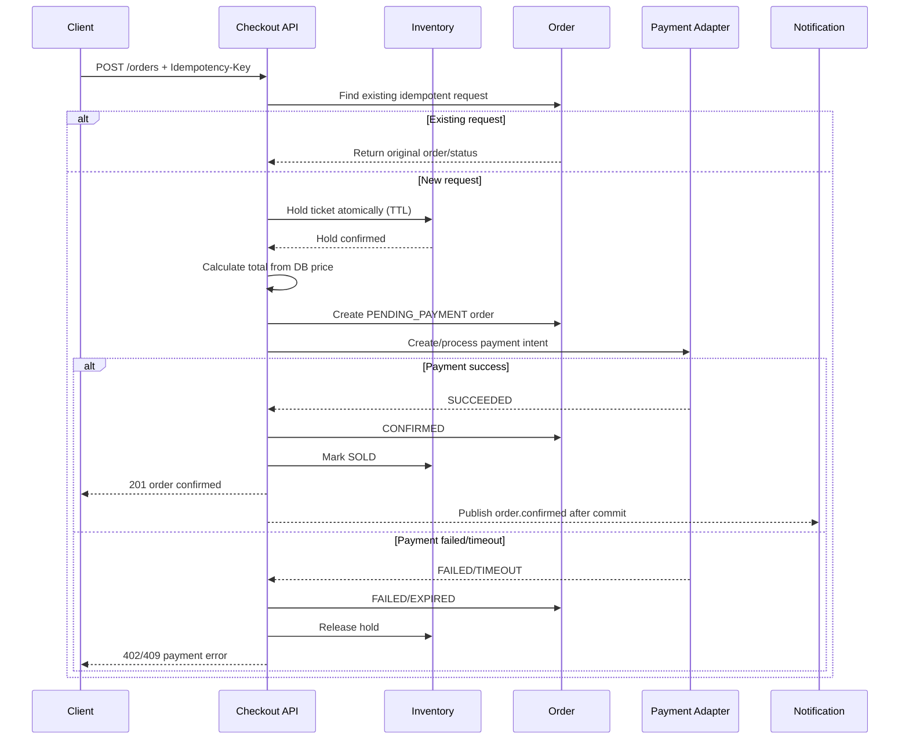

# TSM Project Blueprint

> **Document status:** Approved implementation blueprint / living document  
> **Repository:** `yornthanon/TSM`  
> **Last updated:** 2026-10-05  
> **Audience:** Product owner, backend/frontend developers, QA, DevOps, and future maintainers

---

## 1. Purpose of this document

ឯកសារនេះត្រូវបានសរសេរ **មុនការអភិវឌ្ឍ feature ថ្មី** ដើម្បីឲ្យ developer ថ្មីអាចយល់បានថា៖

- Project នេះដោះស្រាយបញ្ហាអ្វី និងអ្នកប្រើប្រាស់ជានរណា
- Feature អ្វីខ្លះជាកាតព្វកិច្ចរបស់ MVP និងអ្វីជាផែនការបន្ទាប់
- Technology និង architecture ដែលត្រូវប្រើ
- Database ត្រូវរៀបចំយ៉ាងដូចម្តេច និងទំនាក់ទំនងរបស់ table ទាំងអស់
- API និង business workflow ត្រូវធ្វើដូចម្តេច
- សិទ្ធិ user និង tenant isolation ត្រូវការពារយ៉ាងដូចម្តេច
- Definition of Done និង development phases ត្រូវវាស់វែងយ៉ាងដូចម្តេច

> **Rule:** កុំចាប់ផ្តើមសរសេរ code សម្រាប់ feature ថ្មី ប្រសិនបើ feature នោះមិនទាន់មាននៅក្នុង document នេះ ឬមិនទាន់ update document នេះជាមុន។

---

## 2. Project summary

**TSM (Ticket Sales Management)** គឺជា event ticketing platform សម្រាប់ឲ្យ workspace/tenant មួយៗអាច៖

1. បង្កើត និងគ្រប់គ្រង event
2. បង្កើត ticket inventory/seat និងកំណត់តម្លៃ
3. ឲ្យអតិថិជន browse event និងទិញ ticket
4. បង្កើត order និងដំណើរការទូទាត់
5. ផ្ញើ confirmation តាម email/SMS
6. ឲ្យ Tenant Admin មើលស្ថិតិ និងគ្រប់គ្រងអាជីវកម្មរបស់ខ្លួន
7. ឲ្យ Platform Admin មើល និងគ្រប់គ្រង workspace ទាំងមូលដោយមាន audit trail

### 2.1 Core business value

- កាត់បន្ថយការលក់ seat លើសចំនួន (overselling)
- ធ្វើឲ្យ order/payment មាន traceability និង idempotency
- បែងចែកទិន្នន័យរបស់ workspace នីមួយៗឲ្យដាច់ពីគ្នា
- ផ្តល់ dashboard សម្រាប់ប្រតិបត្តិការ និងរបាយការណ៍
- មាន architecture ដែលអាច scale ទៅ real payment provider និង async notification នៅពេលក្រោយ

### 2.2 Scope assumptions

- Event មាន owner ជា workspace មួយ។
- User ធម្មតាស្ថិតនៅក្នុង workspace មួយ active។
- Platform Admin អាចមើល global data ប៉ុន្តែការបង្កើត/កែប្រែ tenant-owned data ត្រូវមាន selected workspace ឬ audited act-as context។
- MVP ប្រើ mock payment provider បាន ប៉ុន្តែ payment contract ត្រូវរៀបចំឲ្យប្តូរទៅ Stripe/ABA បាន។
- Frontend ជា admin/operations dashboard ក្នុង repository បច្ចុប្បន្ន។ Public customer storefront អាចបន្ថែមជា phase បន្ទាប់ ប្រសិនបើ product owner អនុម័ត។

---

## 3. Current state vs target state

### 3.1 Current state (ត្រូវដឹងមុនកែ code)

Repository មាន module ចាស់ៗជា microservices (`user-service`, `event-service`, `ticket-service`, `order-service`, `payment-service`, `notification-service`, `api-gateway`) ប៉ុន្តែ production model ដែលបានកត់ត្រាបច្ចុប្បន្នគឺ៖

- Render static frontend
- Render Spring Boot `app-monolith`
- Neon PostgreSQL
- Redis សម្រាប់ cache/rate limit/lock (តាម environment)
- Flyway migrations និង tenant/workspace isolation
- Google OAuth + JWT/refresh token

ឯកសារ `docs/api-contract.md` និង `docs/security-findings.md` ពិពណ៌នា behavior/defects របស់ implementation ចាស់ មិនមែន target contract ទាំងអស់ទេ។

### 3.2 Architectural decision

> **Decision: Monolith-first for the next implementation phase.**

ហេតុផល៖

- Checkout ត្រូវការ transactional consistency រវាង inventory, order, និង payment intent។
- Current deployment និង Flyway schema ជា single application/database។
- Microservices code paths មាន duplicated security និង cross-service contract gaps។
- ការបំបែក service មុនពេល business rules ត្រូវបាន test នឹងបង្កើន failure modes។

**Target now:** modular monolith ជាមួយ domain modules ច្បាស់ៗ និង database schema តែមួយ។  
**Target later:** extract payment/notification/search modules ទៅ service ដាច់ដោយឡែក នៅពេលមាន load/team boundary ច្បាស់ និង contract tests គ្រប់គ្រាន់។

### 3.3 Non-negotiable fixes before exposing checkout

1. Server ត្រូវគណនាតម្លៃពី ticket/event price; មិនទុកចិត្ត `amount` ពី client។
2. Checkout ត្រូវ reserve inventory atomically ហើយ seat មួយមិនអាចលក់បានពីរដង។
3. Payment failure/timeout ត្រូវធ្វើ compensation: order `FAILED`/`EXPIRED` និង release inventory។
4. Checkout ត្រូវប្រើ `Idempotency-Key`; retry ដដែលត្រូវត្រឡប់ order ចាស់។
5. Error ត្រូវប្រើ HTTP status ត្រឹមត្រូវ (`400/401/403/404/409/422/500`)។
6. Admin routes និង notification routes ត្រូវ enforce authorization នៅ backend មិនពឹង frontend/gateway តែប៉ុណ្ណោះ។
7. User មិនអាចកែ/លុប user ផ្សេង ឬកែ RBAC ដោយគ្មាន Admin permission។
8. Tenant scope ត្រូវ resolve ពី authenticated principal; មិនទុកចិត្ត `X-Tenant-Id` ពី user ធម្មតា។

---

## 4. User roles and access model

### 4.1 Roles

| Role | Scope | Main responsibility |
|---|---|---|
| `ADMIN` | Platform-wide | Manage users/workspaces/access/system; global reporting; audited act-as |
| `TENANT_ADMIN` | One workspace | Manage own events, inventory, orders, permitted refunds and reports |
| `USER` | One workspace | View own workspace data and perform permitted customer actions such as checkout/cancel |
| `INTERNAL_SERVICE` | Service-to-service only | Internal callbacks/events; no browser access |

### 4.2 Workspace rules

- Google account ថ្មីដែល verified ត្រូវបាន provision ជា user + workspace មួយ។
- `users.tenant_id` ជា source of truth សម្រាប់ user scope។
- `tenant_workspaces` ជា global metadata table។
- Tenant-owned rows ត្រូវមាន `tenant_id` និងត្រូវ filter ក្នុង backend។
- `ADMIN` គ្មាន tenant context = global read/admin scope។
- `ADMIN` mutation លើ tenant data = ត្រូវមាន selected workspace ឬ act-as session ដែល audit បាន។
- Workspace `SUSPENDED` មិនអនុញ្ញាតឲ្យ non-admin ប្រើប្រាស់។

### 4.3 Access matrix (MVP)

| Capability | USER | TENANT_ADMIN | ADMIN |
|---|---:|---:|---:|
| Login/profile/MFA | Own | Own | Own |
| Browse approved events | Own scope | Own scope | Global |
| Create/update/delete event | No | Own workspace | Selected workspace |
| Approve/reject event | No | Own policy | Selected workspace |
| Manage ticket inventory | No/read | Own workspace | Selected workspace |
| Create checkout/order | Yes | Yes | Only as selected user/context |
| Cancel own order | Yes | Yes | N/A; use force-cancel policy |
| Force-cancel/refund | No | Policy-based | Yes |
| View own orders/payments | Own | Own workspace | Global |
| Users/workspaces/RBAC | No | No | Yes |
| Notification logs/resend | No | No | Yes |
| System/audit reports | No | Own operational reports | Global |

> Frontend route guards គឺ UX ប៉ុណ្ណោះ។ Backend authorization និង tenant filter ជា security boundary ពិតប្រាកដ។

---

## 5. Functional requirements / feature backlog

### 5.1 MVP (must have)

#### A. Authentication and account

- Google OAuth login ជាមួយ verified email និង stable Google `sub`
- JWT access token + refresh token rotation
- Logout/revocation និង token reuse detection
- MFA/TOTP enable, verify, disable
- `GET /users/me` សម្រាប់ profile/role/workspace context
- Login rate limit និង account status (`ACTIVE`, `SUSPENDED`, `DISABLED`)

#### B. Workspace and tenancy

- Provision one workspace per new non-admin Google account
- Workspace status lifecycle: `ACTIVE`, `SUSPENDED`, `ARCHIVED`
- Admin global workspace list/status update
- Audited Admin act-as workspace session
- Every tenant-owned query scoped by authenticated tenant

#### C. Event management

- Create/update/delete draft event
- Event fields: title, description, type, venue, start/end time, timezone, image, status
- Status lifecycle: `DRAFT -> PENDING_APPROVAL -> APPROVED -> PUBLISHED -> CANCELLED/COMPLETED`
- Search/filter/pagination by status, date, type, workspace
- Approve/reject with reason and audit log

#### D. Ticket inventory

- Create ticket/seat or ticket category with price and quantity
- Availability states: `AVAILABLE`, `HELD`, `SOLD`, `CANCELLED`
- Atomic hold with TTL
- Release expired holds
- Database uniqueness/locking preventing oversell
- Admin inventory summary by event/status

#### E. Checkout, orders, payments

- Validate event/ticket is published and sellable
- Calculate subtotal/fees/discount/total server-side
- Acquire inventory lock/hold
- Create order with idempotency key
- Create payment intent and process mock provider
- Success: payment `SUCCEEDED`, order `CONFIRMED`, inventory `SOLD`
- Failure/timeout: payment `FAILED`, order `FAILED`/`EXPIRED`, inventory released
- Customer order history/detail and cancellation policy
- Admin/Tenant Admin operational order list with filters

#### F. Notifications

- Confirmation email after confirmed order
- Failed payment/expiration notification where configured
- Notification status: `PENDING`, `SENT`, `FAILED`, `RETRYING`
- Retry with exponential backoff and dead-letter handling
- Admin-only notification log/resend

#### G. Dashboard and reporting

- KPI cards: events, available/sold tickets, orders, revenue, failed payments
- Tenant Admin sees own workspace only
- Admin sees global totals and per-workspace breakdown
- Date-range filters and CSV export for orders/payments (MVP+ if time permits)

### 5.2 Phase 2

- Real payment gateway (Stripe/ABA) with webhook signature verification
- Discounts/coupons, service fees, tax, refunds/partial refunds
- Public customer storefront and QR/mobile ticket
- Seat map editor and reserved seating
- Email template management and i18n (Khmer/English)
- Search index (OpenSearch/Meilisearch) if PostgreSQL search is insufficient
- Push notification (FCM)

### 5.3 Phase 3

- Extract payment and notification into independently deployable services
- Kafka/outbox event streaming
- Multi-region/read replica strategy
- Kubernetes manifests and autoscaling
- Mobile app (React Native)

### 5.4 Explicitly out of scope for MVP

- Cryptocurrency payment
- Marketplace between unrelated sellers
- Fully dynamic seat-map CAD editor
- Anonymous checkout without an account
- Hard delete of financial/order records

---

## 6. Recommended technology stack

### 6.1 Backend

| Area | Technology | Rule |
|---|---|---|
| Language | Java 21 | Use records for API DTOs where appropriate |
| Framework | Spring Boot 4.x | Modular monolith first |
| Security | Spring Security + JWT + Google OAuth2 | Backend is authoritative |
| Persistence | Spring Data JPA/Hibernate | No cross-module repository access |
| Database | PostgreSQL 15+ / Neon | UUID or BIGINT consistently; use migrations |
| Migration | Flyway | `ddl-auto=validate`; never `create-drop` in shared env |
| Cache/lock | Redis 7+ | Holds/rate limit; DB constraints remain mandatory |
| Async | Spring events initially; Kafka + outbox later | Do not claim Kafka is active until wired and tested |
| Mapping | MapStruct | DTO/entity boundary |
| Validation | Jakarta Bean Validation | Validate request and business rules |
| Observability | Actuator, structured logs, correlation ID, tracing | No secrets/PII in logs |

### 6.2 Frontend

- React + TypeScript + Vite
- React Router
- TanStack Query for server state/cache
- Axios with one response envelope/error interceptor
- React Hook Form + Zod
- Tailwind CSS + accessible component patterns
- Recharts for dashboard analytics
- Day.js for timezone-safe display

### 6.3 Infrastructure

- Render for web services/static frontend (current deployment)
- Neon PostgreSQL for managed database
- Redis for lock/cache/rate limit
- Cloudinary/object storage for event images
- Docker Compose for local development
- GitHub Actions for lint, build, tests, migration checks, and deploy trigger

### 6.4 Engineering principles

- Modular boundaries before distributed boundaries
- API contract first; OpenAPI is the reference
- UTC in storage; explicit timezone in event display
- Money uses `NUMERIC(12,2)`/`BigDecimal`, never floating point
- No secrets in Git; `.env.example` only contains names and safe examples
- Soft delete/archive for business records; audit financial mutations

---

## 7. Target architecture



### 7.1 Module ownership

| Module | Owns | Must not do |
|---|---|---|
| Identity | users, roles, sessions, MFA, OAuth | Expose password/token internals |
| Workspace | workspaces, tenant context, act-as | Trust tenant header from normal user |
| Event | events, publishing, event images | Create orders or mutate payments |
| Inventory | ticket/seat state, holds, availability | Calculate payment total |
| Checkout | order state machine, idempotency | Accept client price as source of truth |
| Payment | payment intent/transaction/refund | Decide event/ticket ownership |
| Notification | delivery attempts/templates | Block checkout synchronously after commit |
| Audit/Reporting | immutable audit entries, read models | Become source of truth for transactions |

### 7.2 Checkout sequence



---

## 8. Database design

### 8.1 Database rules

- One PostgreSQL database is acceptable for the modular monolith.
- Use Flyway migrations in a single, monotonic version chain.
- Every table has `id`, `created_at`, `updated_at` unless it is a pure join table.
- Tenant-owned tables include non-null `tenant_id` and an index beginning with `tenant_id`.
- Foreign keys are enforced inside the monolith database. Cross-service references must not be called foreign keys.
- Use `ON DELETE RESTRICT` for financial records and `ON DELETE CASCADE` only for join/session rows.
- Add optimistic locking (`version`) to event, ticket, order, and payment entities where concurrent updates are possible.

### 8.2 Core tables

| Table | Purpose | Important constraints |
|---|---|---|
| `tenant_workspaces` | Tenant boundary and owner | unique owner; status check |
| `users` | Login/profile/tenant link | unique lower(email), unique google_subject |
| `roles` | `ADMIN`, `TENANT_ADMIN`, `USER`, `INTERNAL_SERVICE` | unique name |
| `user_roles` | User-role join | composite PK |
| `permissions` | Fine-grained permission catalog | unique code |
| `role_permissions` | Role-permission join | composite PK |
| `refresh_tokens` | Rotatable sessions | hash only; revoke/reuse fields |
| `oauth_login_codes` | One-time OAuth exchange | hash PK; expiry/consumed index |
| `events` | Event master data | tenant FK; lifecycle check |
| `event_images` | Optional image metadata | event FK |
| `ticket_products` | Ticket category/seat inventory | event FK; price >= 0 |
| `inventory_holds` | Temporary reservation | unique active hold per ticket/order |
| `orders` | Customer purchase aggregate | idempotency unique per user/tenant |
| `order_items` | Order line items | snapshot name/price/tax |
| `payments` | Payment ledger | provider transaction unique |
| `refunds` | Refund records | immutable amount/status |
| `notifications` | Delivery attempts | order/user/tenant FK |
| `audit_logs` | Security/business audit | append-only |
| `outbox_events` | Reliable async publishing | unique event id; status/retry |

### 8.3 Proposed ERD

```mermaid
erDiagram
    TENANT_WORKSPACES ||--o{ USERS : contains
    TENANT_WORKSPACES ||--o{ EVENTS : owns
    TENANT_WORKSPACES ||--o{ ORDERS : scopes
    TENANT_WORKSPACES ||--o{ PAYMENTS : scopes
    TENANT_WORKSPACES ||--o{ NOTIFICATIONS : scopes
    USERS ||--o{ USER_ROLES : assigned
    ROLES ||--o{ USER_ROLES : grants
    ROLES ||--o{ ROLE_PERMISSIONS : includes
    PERMISSIONS ||--o{ ROLE_PERMISSIONS : defines
    USERS ||--o{ REFRESH_TOKENS : owns
    USERS ||--o{ OAUTH_LOGIN_CODES : exchanges
    EVENTS ||--o{ TICKET_PRODUCTS : offers
    TICKET_PRODUCTS ||--o{ INVENTORY_HOLDS : held
    USERS ||--o{ INVENTORY_HOLDS : creates
    USERS ||--o{ ORDERS : places
    EVENTS ||--o{ ORDERS : receives
    ORDERS ||--|{ ORDER_ITEMS : contains
    TICKET_PRODUCTS ||--o{ ORDER_ITEMS : sold_as
    ORDERS ||--o{ PAYMENTS : attempts
    PAYMENTS ||--o{ REFUNDS : has
    ORDERS ||--o{ NOTIFICATIONS : triggers
    ORDERS ||--o{ OUTBOX_EVENTS : emits
    USERS ||--o{ AUDIT_LOGS : performs

    TENANT_WORKSPACES {
      bigint id PK
      varchar name
      varchar status
      bigint owner_user_id UK
      timestamptz created_at
    }
    USERS {
      bigint id PK
      bigint tenant_id FK_NULLABLE
      varchar email UK
      varchar google_subject UK_NULLABLE
      varchar status
      boolean mfa_enabled
    }
    EVENTS {
      bigint id PK
      bigint tenant_id FK
      varchar title
      varchar status
      timestamptz starts_at
      timestamptz ends_at
      varchar timezone
    }
    TICKET_PRODUCTS {
      bigint id PK
      bigint event_id FK
      varchar code
      varchar seat_number_NULLABLE
      numeric unit_price
      int quantity
      int available_quantity
      varchar status
    }
    INVENTORY_HOLDS {
      bigint id PK
      bigint ticket_product_id FK
      bigint user_id FK
      bigint order_id FK_NULLABLE
      varchar status
      timestamptz expires_at
    }
    ORDERS {
      bigint id PK
      bigint tenant_id FK
      bigint user_id FK
      varchar order_number UK
      varchar status
      numeric subtotal
      numeric total
      varchar idempotency_key
    }
    ORDER_ITEMS {
      bigint id PK
      bigint order_id FK
      bigint ticket_product_id FK
      numeric unit_price_snapshot
      int quantity
    }
    PAYMENTS {
      bigint id PK
      bigint order_id FK
      varchar provider
      varchar provider_transaction_id UK_NULLABLE
      numeric amount
      varchar status
    }
    NOTIFICATIONS {
      bigint id PK
      bigint tenant_id FK
      bigint order_id FK_NULLABLE
      varchar channel
      varchar status
      int attempt_count
    }
    AUDIT_LOGS {
      bigint id PK
      bigint actor_user_id FK_NULLABLE
      bigint tenant_id FK_NULLABLE
      varchar action
      varchar resource_type
      bigint resource_id
      jsonb metadata
    }
    OUTBOX_EVENTS {
      uuid id PK
      varchar event_type
      jsonb payload
      varchar status
      int attempt_count
      timestamptz published_at_NULLABLE
    }
```

### 8.4 Critical indexes and constraints

```sql
-- Never allow the same user to submit the same checkout twice.
CREATE UNIQUE INDEX ux_orders_idempotency
  ON orders (tenant_id, user_id, idempotency_key)
  WHERE idempotency_key IS NOT NULL;

-- One physical seat cannot be active in multiple sale records.
CREATE UNIQUE INDEX ux_active_event_seat
  ON ticket_products (event_id, seat_number)
  WHERE seat_number IS NOT NULL AND status <> 'CANCELLED';

CREATE INDEX ix_events_tenant_status_date
  ON events (tenant_id, status, starts_at);

CREATE INDEX ix_holds_expiry
  ON inventory_holds (status, expires_at);

CREATE INDEX ix_orders_tenant_created
  ON orders (tenant_id, created_at DESC);
```

> Exact SQL must be reconciled with existing migrations before adding a version. Never reuse a migration version that already exists in any deployed database.

---

## 9. API contract (target)

### 9.1 Common rules

- Base URL: `/api/v1`
- JSON response envelope is consistent across gateway and application.
- Success uses HTTP `200/201/204`; errors use real HTTP status codes.
- Every response includes `X-Correlation-ID` (or returns the received value).
- Protected requests require `Authorization: Bearer <token>`.
- Checkout requires `Idempotency-Key`.
- List endpoints use cursor/page pagination, filters, and stable sort.

```json
{
  "data": {},
  "meta": { "requestId": "..." },
  "error": null
}
```

```json
{
  "data": null,
  "meta": { "requestId": "..." },
  "error": {
    "code": "INVENTORY_UNAVAILABLE",
    "message": "The selected ticket is no longer available.",
    "details": []
  }
}
```

### 9.2 Endpoint groups

| Group | Example endpoints | Main roles |
|---|---|---|
| Auth | `GET /auth/oauth/google`, `POST /auth/refresh`, `POST /auth/logout` | Public/authenticated |
| Me | `GET /users/me`, `PUT /users/me`, `/users/me/mfa/*` | All app roles |
| Workspaces | `GET /workspaces/current`, `GET /admin/workspaces`, `POST /admin/act-as` | Own/Admin |
| Events | `GET /events`, `POST /events`, `PATCH /events/{id}`, `POST /events/{id}/approve` | Read/Tenant Admin/Admin |
| Inventory | `GET /events/{id}/tickets`, `POST /tickets`, `POST /holds`, `DELETE /holds/{id}` | Read/Tenant Admin |
| Orders | `POST /orders`, `GET /orders`, `GET /orders/{id}`, `POST /orders/{id}/cancel` | User/Tenant Admin/Admin policy |
| Payments | `GET /payments`, `POST /payments/{id}/refund`, `POST /payments/webhooks/{provider}` | Tenant Admin/Admin/provider |
| Notifications | `GET /admin/notifications`, `POST /admin/notifications/{id}/retry` | Admin |
| Reports | `GET /reports/overview`, `GET /reports/revenue`, `GET /reports/export` | Tenant Admin/Admin |

### 9.3 Checkout request/response

```http
POST /api/v1/orders
Authorization: Bearer <access-token>
Idempotency-Key: checkout-unique-key-123
Content-Type: application/json
```

```json
{
  "eventId": 10,
  "items": [{ "ticketProductId": 55, "quantity": 2 }],
  "paymentMethod": "MOCK_CARD"
}
```

Client **must not** send an authoritative amount. Server response contains calculated subtotal/fees/total and the order state.

---

## 10. Security and data protection requirements

- Enforce least privilege with method-level and route-level authorization.
- Add security tests for every role and every tenant boundary.
- Hash refresh tokens and OAuth handoff codes; never store raw reusable secrets.
- Encrypt or minimize payment/PII data; do not store card PAN/CVV.
- Validate webhook signature, timestamp, and replay protection.
- Rate-limit login, OAuth exchange, checkout, resend, and admin mutation routes.
- Use CSRF strategy appropriate to token transport; configure CORS allowlist, not `*` in production.
- Log actor, tenant, action, resource, correlation ID; redact tokens, passwords, payment secrets, and sensitive PII.
- Financial and audit records are append-only; corrections use compensating records.
- Use `@Transactional` for state changes and an outbox for after-commit events.
- Do not expose stack traces or database error details to clients.

---

## 11. Development phases

### Phase 0 — Foundation and contract (1 sprint)

- Confirm product decisions: storefront scope, payment provider, cancellation/refund policy, fees/tax.
- Freeze target API envelope and error catalog.
- Clean module boundaries and remove misleading “completed” claims from README.
- Add CI: frontend lint/build, backend tests, migration validation.
- Create ADRs for monolith-first, tenancy, money, and checkout state machine.

**Exit criteria:** approved API/ERD/role matrix; CI is green; no new feature coding before sign-off.

### Phase 1 — Security and tenancy hardening (1–2 sprints)

- Fix user ownership/admin route authorization.
- Enforce notification Admin-only policy.
- Ensure all application routes use tenant context.
- Standardize HTTP status and response envelope.
- Add regression tests for `ADMIN`, `TENANT_ADMIN`, `USER`, cross-tenant access, and suspended workspace.

**Exit criteria:** no critical/high auth findings; cross-tenant tests pass.

### Phase 2 — Event and inventory (1–2 sprints)

- Complete event lifecycle, filters, pagination, image metadata.
- Implement ticket product/seat model and availability.
- Implement atomic hold TTL, expiry worker, and DB constraints.
- Add concurrency tests with multiple checkout attempts for one seat.

**Exit criteria:** one seat can never become two confirmed sales under concurrent requests.

### Phase 3 — Safe checkout and payment (2 sprints)

- Implement server-side pricing.
- Implement order state machine and idempotency.
- Add payment adapter interface + mock provider.
- Implement failure compensation and cancellation/refund policy.
- Add order/payment audit trail.

**Exit criteria:** duplicate retry returns same order; manipulated amount is rejected/ignored; payment failure releases inventory.

### Phase 4 — Notifications and dashboard (1 sprint)

- Outbox event after confirmed order.
- Notification retry/DLQ policy.
- Role-scoped dashboard queries and report filters.
- Add CSV export if performance is acceptable.

**Exit criteria:** notification failure does not roll back a confirmed order; dashboard cannot leak tenant data.

### Phase 5 — Production readiness (1 sprint)

- Load/concurrency test checkout.
- Backup/restore drill for Neon.
- Security review, dependency scan, secret review.
- Observability dashboards and alert thresholds.
- Staging deployment and smoke test.

**Exit criteria:** release checklist complete and rollback procedure tested.

---

## 12. Testing strategy

### Unit tests

- Price calculation and rounding
- Order state transitions
- Role/permission rules
- Tenant context resolution
- Hold expiry and cancellation policy
- Payment adapter mapping

### Integration tests

- Flyway fresh database migration
- Repository tenant filters
- Checkout transaction with PostgreSQL + Redis test containers
- Payment failure compensation
- Outbox publishing and notification retry

### API/contract tests

- OpenAPI schema validation
- Standard response/error envelope
- HTTP status semantics
- Idempotency replay behavior
- Webhook signature/replay protection

### Security regression tests

- Unauthenticated route returns `401`
- Wrong role returns `403`
- User cannot access another tenant's event/order/payment
- Tenant Admin cannot access platform Admin endpoints
- Admin mutation without selected tenant is rejected
- User cannot delete/update another user or modify RBAC

### Minimum commands before PR

```bash
# Frontend
cd frontend-admindashboard
npm run lint
npm run build

# Backend
cd ..
./mvnw test
```

---

## 13. Definition of Done

A feature is complete only when:

- Requirement and acceptance criteria are written in this document or linked issue.
- API request/response and authorization matrix are updated.
- Database migration, indexes, constraints, and rollback considerations are reviewed.
- Backend unit/integration/security tests are added.
- Frontend loading, empty, error, permission, and success states are implemented.
- Audit/correlation/logging behavior is defined.
- Documentation/README/API contract is updated.
- `npm run lint`, `npm run build`, and relevant `./mvnw test` pass.
- No secrets, fake “success” status, client-controlled money, or unbounded query is introduced.
- Reviewer confirms tenant isolation and concurrency behavior where relevant.

---

## 14. Open decisions requiring product-owner confirmation

These items affect implementation materially and must be decided before the related phase:

1. Public customer storefront: same React app or separate app?
2. Payment provider for production: Stripe, ABA, or another provider?
3. Currency and tax/service-fee rules (assumption: USD, `NUMERIC(12,2)`).
4. Cancellation/refund window and who pays gateway fees.
5. Whether ticket model is general admission quantity, reserved seat, or both for MVP.
6. Email/SMS provider, sender identity, and Khmer/English templates.
7. Maximum checkout hold TTL and order expiration period.
8. Data retention policy for users, orders, payments, notifications, and audit logs.
9. Required availability/SLO and expected peak concurrent checkouts.
10. Whether `ADMIN` can impersonate a user or only act as a workspace administrator.

Until these are decided, use the documented defaults, keep them behind configuration, and record any deviation in an ADR.

---

## 15. Source-of-truth files in this repository

- `README.md` — setup and high-level repository overview
- `docs/TSM_PLATFORM_ACCESS_AND_ERD.md` — current tenancy, OAuth, role behavior, and existing ERD
- `docs/api-contract.md` — implemented/current API behavior and known deviations
- `docs/security-findings.md` — reproduced security/correctness findings
- `app-monolith/src/main/resources/db/migration/` — current monolith migration chain
- `frontend-admindashboard/` — current React dashboard

When this blueprint conflicts with an implementation detail, treat this file as the **target plan**, treat the source code and current docs as **current state**, and create a migration task/ADR rather than silently changing behavior.

---

## 16. Change-control checklist

When changing a role, endpoint, table, or business rule:

1. Update this document first.
2. Update OpenAPI/API contract.
3. Update backend authorization and tenant-scope enforcement.
4. Update frontend route/button visibility.
5. Add unit, integration, and security regression tests.
6. Add a new Flyway migration if schema changes.
7. Run local validation and review logs/metrics.
8. Deploy to staging, run smoke/concurrency tests, then production.

> **Never treat a hidden frontend button as authorization. Never allow global Admin tenant writes without explicit workspace context. Never trust a client-supplied amount for payment.**
